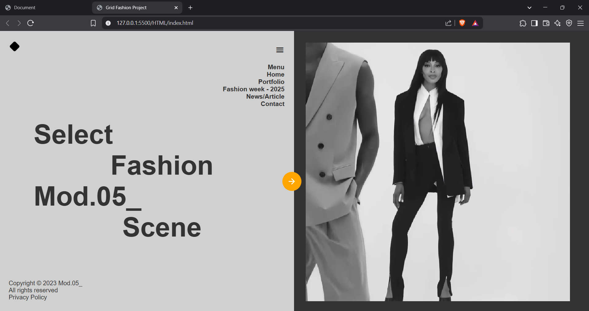

# 🎨 HTML & CSS Grid Project

This is a responsive fashion-themed web design built using *HTML* and *CSS Grid* layout. It displays modern layout design with video background and a responsive menu.

---

## 🛠 Features

- 🎥 Video background
- 📱 Fully responsive using media queries
- 🎨 Stylish layout using CSS Grid
- 📂 Organized folder structure
- 💻 Clean, semantic HTML

---

## 💡 Skills Used

- HTML5
- CSS3
- CSS Grid
- Responsive Design

---
## 📸 Website Preview

## 🙋‍♂ Author

- GitHub: [@Ayush-Raghuwanshi-Dev](https://github.com/Ayush-Raghuwanshi-Dev)

---
## 📩 Feedback

If you find any bugs or have suggestions, feel free to open an issue or connect with me!
